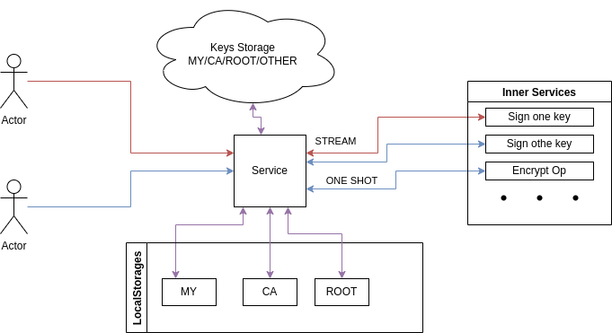

# DRAFT: CryptoPro GRPC Service

Golang binding for certificated russian GOST Crypto
Provider [CryptoPro CSP](https://cryptopro.ru/products/cryptopro-csp)

Единое GRPC для взаимодействия с КриптоПРО SDK

Используйте
```
protoc/grpc_service_sign.proto
```
для генерации клиента

## Idea



### Установка
1. Скачать CSP 5.0 https://www.cryptopro.ru/products/csp/downloads
2. Разархивировать и установить командой `./install.sh`
3. Скачать `git clone github.com/number571/go-cryptopro`
4. Запустить `go run main.go`

### Подготовка

1. Импортируйте сертифкаты в хранилище пользователя под которым работает сервис
2. Запустите сервис $cryptopro-jsonrpc rpc

## Now supported
* Low Level Sign Buffer (stream)

### TODO
* MsgType Buffer (stream)
* MsgType File (one shot)
* Cloud Store
* Low Level Verify Buffer (stream)

* Low Level File Stream Sign (one shot)
* Low Level File Stream Verify (one shot)
* Low Level File Stream Encrypt (one shot)
* Low Level File Stream Decrypt (one shot)

* List certificates in store
* Find certificate by SHA1 
* Add an encoded certificate to store
* Get Certificate Information (CRL,OCSP URL,Name,Serial ...)

* Low Level CoSign
* Examples

#### MayBe
* Find Certificate by other attributes
* Generate Hash
* Sign Hash


##### Пример использования
```go
	conn, err := grpc.Dial(`localhost:8080`, opts...)
	if err != nil {
		log.Println(`Dial`, err)
		return
	}
	c := grpc_service.NewServiceClient(conn)

	res, err := c.Sign(ctx, &grpc_service.SignRequest{
		Storage: "uMY",
		Content: []byte("HelloWorld"),
		Key:     "762f84827e9199f72043f01d548ad86503b7fa98",
	})

	if err != nil {
		log.Println(err)
		t.FailNow()
	}

	log.Println(`Done`)
	log.Println(string(res.Content))
```


## Errors 

### Open Cert (0x80092004)

Попробуйте установить сертификат с привязкой к ключевому контейнеру под нужным пользователем:
```
sudo -u www-data /opt/cprocsp/bin/amd64/csptest -absorb -certs -autoprov
```


### Big Thanks to [https://www.get-net.ru/](https://github.com/get-net/cryptopro)